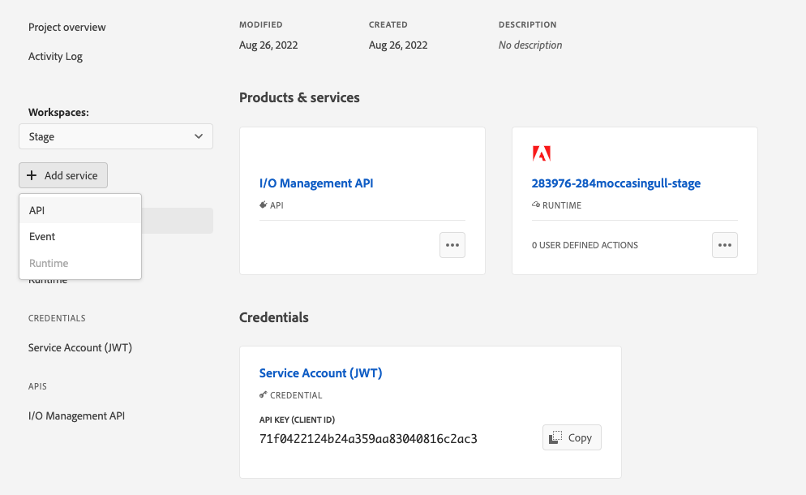
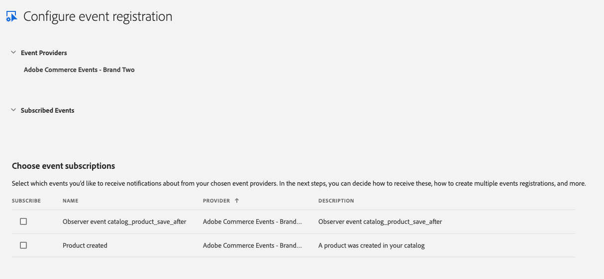
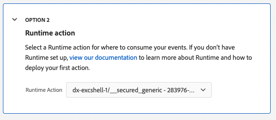

# Install and configure Adobe I/O Events

After you have created an [App Builder project](./project-setup.md), you must install the Commerce modules that enable integrations with Adobe I/O Events.

## Install Adobe I/O modules on Commerce

Make the following modifications to your `composer.json` file:

*  Add a `repositories` section beneath the `config` section. If the `repositories` section already exists, add the following lines to the bottom of the section.

   ```json
   "repositories": {
      "module-adobe-io-events": {
        "type": "git",
        "url": "git@github.com:magento/module-adobe-io-events.git"
      },
      "event-plugin-generator": {
        "type": "git",
        "url": "git@github.com:magento/event-plugin-generator.git"
      },
      "module-commerce-events-client": {
        "type": "git",
        "url": "git@github.com:magento/module-commerce-events-client.git"
      }
   },
   ```

*  Add the following lines to the bottom of the `require` section:

   ```json
   "magento/module-adobe-io-events": "dev-master as 0.99",
   "magento/module-commerce-events-client": "dev-main as 0.99",
   "magento/event-plugin-generator": "dev-main as 0.99"
   ```

*  Find the `prefer-stable` line and modify the minimum stability:

   ```json
   "prefer-stable": true,
   "minimum-stability": "dev"
   ```

Save your changes. The remaining installation steps vary, depending on your environment.

### Cloud installation

1. In your local environment, run the following command to enable the new modules:

   ```bash
      bin/magento module:enable --all
   ```

1. Add the `app/etc/config.php` file to your working repository:

   ```bash
   git add app/etc/config.php
   ```

1. Update your `.magento.app.yaml` file to include the following build hook:

   ```yaml
   hooks:
      build: |
         set -e
         composer install
         php ./bin/magento events:generate:module
         php ./bin/magento module:enable Magento_AdobeCommerceEvents
         php ./bin/magento module:enable Magento_AdobeCommerceEventsClient
         php ./bin/magento module:enable Magento_AdobeCommerceEventsGenerator
         php ./vendor/bin/ece-tools run scenario/build/generate.xml
         php ./vendor/bin/ece-tools run scenario/build/transfer.xml
   ```

This hook generates and enables the `AdobeCommerceEvents` module, which allows you to register custom events.

<!--Note to reviewer: I deleted references of bin/magento events:metadata:populate because I'm going to assume that a custom module with specific pre-defined events isn't available at initial installation/configuration. I will create a separate "Module development/integration" topic that addresses this command. -->

### Local and on-premises installation

1. Update the project dependencies.

  ```bash
  composer update
  ```

1. Run the following command to generate the `AdobeCommerceEvents` module. This module helps register events. Initially, the module is empty.

   ```bash
   bin/magento events:generate:module
   ```

1. Enable the new modules:

   ```bash
   bin/magento module:enable --all
   ```

1. Upgrade your instance:

   ```bash
   bin/magento setup:upgrade
   ```

1. Compile your instance to generate new classes:

   ```bash
   bin/magento setup:di:compile
   ```

## Begin configuring events on Commerce

You must configure Commerce to communicate with your project. You will need two files that you downloaded from the the Adobe Developer Console.

*  [Private key](./project-setup.md#set-up-a-project)
*  [Workspace configuration](./project-setup.md#download-the-workspace-configuration-file)

1. In the Commerce Admin, navigate to **Stores** > Settings > **Configuration** > **Adobe Services** > **Adobe I/O Events** > **General configuration**.

1. Copy and paste the contents of the `private.key` file into the **Service Account Private Key** field. Use the following command to copy the contents.

   ```bash
   cat config/private.key | pbcopy
   ```

1. Copy the contents of the `<workspace-name>.json` file into the **Adobe I/O Workspace Configuration** field.

1. Enter a unique identifier in the **Adobe Commerce Instance ID** field. This value can be any unique string.

1. Click **Save Config**, but do not leave the page. The next section creates an event provider, which is necessary to complete the configuration.

## Create an event provider and complete the Commerce configuration

You cannot create an event provider until you have configured and saved a private key, workspace file, and instance ID values.

1. Run the following command to create an event provider:

   ```bash
   bin/magento events:create-event-provider --label "<unique provider label>" --description "<provider description>"
   ```

   For example:

   ```bash
   bin/magento events:create-event-provider --label "Staging server provider" --description "Provides out-of-process extensibility for Adobe Commerce"
   ```

   The command displays a message similar to the the following:

   ```terminal
   No event provider found, a new event provider will be created
   A new event provider has been created with ID 63a1f8fe-e911-45a4-9d3f
   ```

1. Copy the ID returned in the command output into the **Adobe I/O Event Provider ID** field in the Admin.

1. Enter the provided URL as the value of the **Endpoint** field.

   **Note**: You must [enable cron](#check-cron-configuration) so that Commerce can send events to the endpoint.

1. Enter the merchant's company name in the **Merchant ID** field. You must use alphanumeric and underscores only.

1. Enter the name of the workspace, such as Stage or Production, in the **Environment ID** field.

1. Click **Save Config**.

1. Register your instance with Adobe Identity Management Services by running the following command:

   ```bash
   bin/magento events:registration:create <ims-org-id>
   ```

   To determine your IMS organization ID, go to the Service Account (JWT) page of your workspace in the Adobe Console.

## Subscribe and register events

You must define which Commerce events to subscribe to, then register them in the project.

Commerce provides two sources for events: observers and plugins. You must specify the source as part of the event name. See [Subscribe to a Commerce event](./commands.md) for details about the syntax of the `events:subscribe` command.

1. If you don't have a module ready for integration with Adobe I/O Events, or you don't know exactly which events to register at this point, use the `events:subscribe` command to subscribe to some sample events, as shown in the following example commands:

   ```bash
   bin/magento events:subscribe observer.catalog_product_save_after
   ```

   ```bash
   bin/magento events:subscribe observer.customer_login
   ```

   If you have a module ready or have specific events in mind, see [Register events](./module-development.md#register-events) for more information.

1. Return to your Stage workspace. Click the **Add service** pop-up menu and select **Event**.

   

1. On the **Add events** page, select your event provider. Then click **Next**.

1. Select the events to subscribe to. Then click **Next**.

   

1. Optionally create a new JWT credential. Then click **Next**.

1. Update the **Event registration name** and **Event registration description** fields. In the **How to receive events** section, under **Option 2**, select the runtime action you created in [Set up App Builder and define a runtime action](./project-setup.md#set-up-app-builder-and-define-a-runtime-action).

   

1. Select **Save configured events**.

You are now set up to develop your App Builder extension.

## Check cron configuration

The `magento/module-commerce-events-client` module uses the `event_data_batch_send` cron job to transmit batches of event messages. This cron job is part of the `default` group.

<InlineAlert variant="info" slots="text"/>

Cron must be enabled so that Commerce can send events to the endpoint defined in **Stores** > Settings > **Configuration** > **Adobe Services** > **Adobe I/O Events** > **General configuration**.

Cloud infrastructure and on-premises instances require different cron management procedures as described here:

*  [Adobe Commerce on cloud infrastructure](https://devdocs.magento.com/cloud/configure/setup-cron-jobs.html)

*  [On premises](https://experienceleague.adobe.com/docs/commerce-operations/configuration-guide/crons/custom-cron-reference.html)
