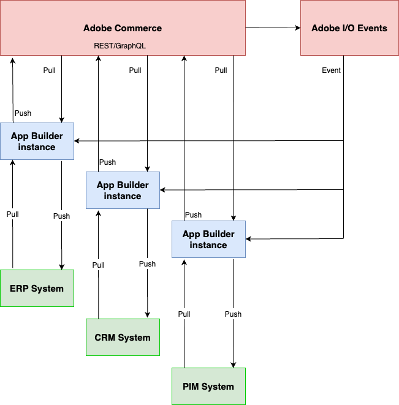

With [Adobe I/O Events](https://developer.adobe.com/events/docs/), developers can create event-driven applications that take action when a shopper performs an action on an Adobe product. These capabilities are now available Adobe Commerce, and as a result, Commerce can now make all transactional data available to applications created with [Adobe App Builder](https://developer.adobe.com/app-builder/docs/getting_started/first_app/).

The following architectural diagram provides an overview of how Adobe I/O Events for Adobe Commerce works.

Imagine that you want to build an extension that notifies a 3rd party Enterprise Resource Planning (ERP) system every time a shopper places an order. In your Commerce module, you register the `plugin.magento.sales.api.order_management.place` event and possibly related events. When a shopper places an order, Commerce sends the event to Adobe I/O Events, which in turn routes the events to the appropriate App Builder application.

Your App Builder application uses any applicable details provided with the event to construct a REST or GraphQL request (pull) to Commerce to gather details about the transaction. It then pushes that information to the ERP system. The ERP system responds to the request, and the App Builder application pushes any new data to Commerce.

This architecture helps merchants efficiently customize processes and integrate systems while maintaining SaaS-like upgradeability. Before event-driven applications, developers were often required to use APIs to poll to determine if something had occurred. Depending on polling frequency, there could be lags. As a result the merchant could be missing out on realtime activities. Shoppers might not have the best possible experiences.
