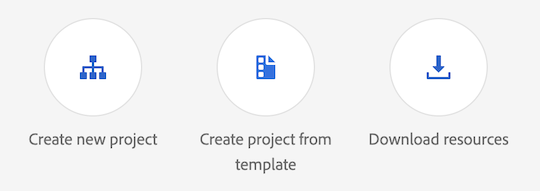
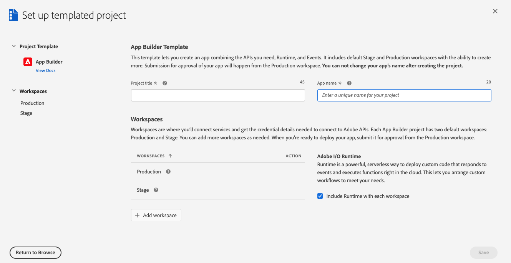
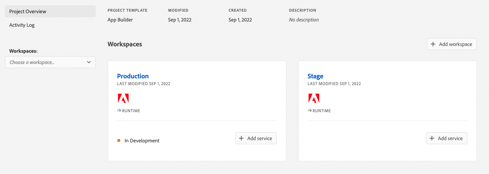
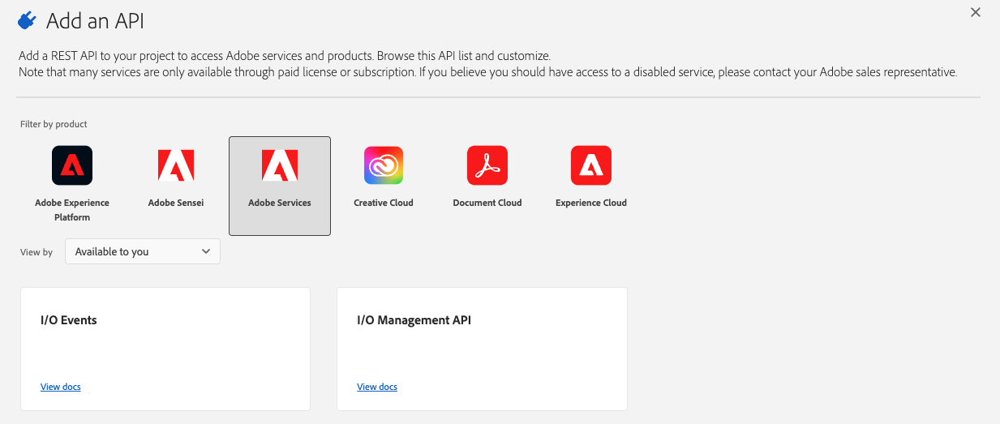
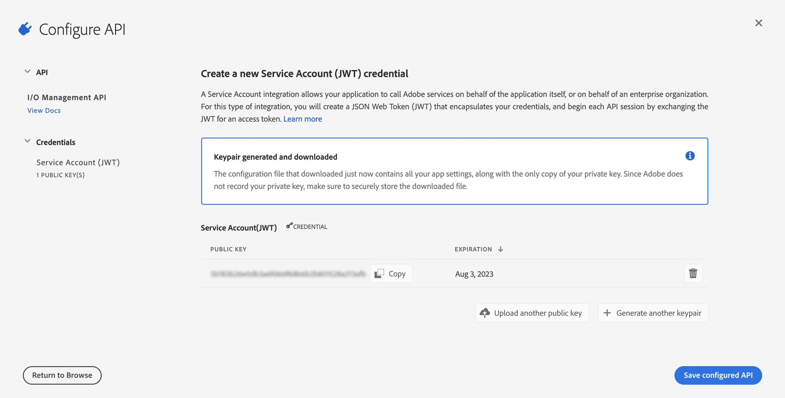
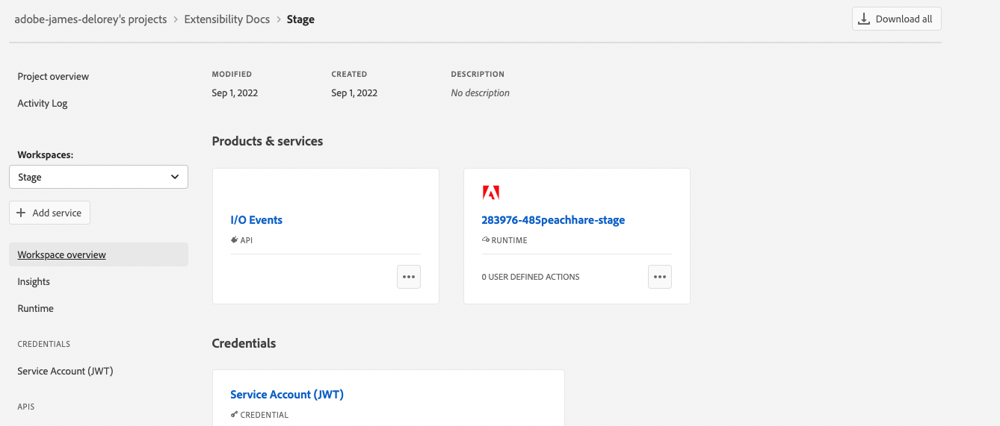

# Create an Adobe I/O Events for Adobe Commerce project

Adobe I/O Events for Adobe Commerce allows you to send and monitor custom Adobe Commerce user-driven events. Follow the instructions on this page to create and configure a project for Adobe I/O Events.

## Requirements

To get started with Adobe I/O Events, you must:

*  Have an Adobe Developer account with System Administrator or Developer Role permissions. [Getting started with Adobe Developer Console](https://developer.adobe.com/developer-console/docs/guides/getting-started/) describes how to enroll in the Adobe developer program.

*  Be familiar with [Adobe I/O Runtime](https://developer.adobe.com/runtime/docs/guides/getting-started/).

*  Install the [`aio CLI`](https://developer.adobe.com/runtime/docs/guides/getting-started/setup/)

*  Have access to an Adobe Commerce on cloud infrastructure or to an on-premises instance.

## Set up a project

[Projects Overview](https://developer.adobe.com/developer-console/docs/guides/projects/) describes the different types of projects and how to manage them. Here, we'll create a templated project.

1. Log in to the Adobe Developer Console and select the desired organization from the dropdown menu in the top-right corner.

1. Click **Create new project** > **Project from template**.

   

1. Select **App Builder**. The **Set up templated project** page displays.

   

1. Specify a project title and app name. Make sure the **Include Runtime with each workspace** checkbox is selected. Click **Save**. The Console creates a workspace.

   

1. In your workspace, click the **Add service** pop-up menu and select **API**.

1. On the **Add an API** page, filter by Adobe Services, select **I/O Management API**, and click **Next**.

   

1. Select the **Generate a key pair** option and click **Generate keypair**. The `config.zip` file downloads automatically.

   

   **Note**: If you want to manually [create a public key certificate](https://developer.adobe.com/developer-console/docs/guides/authentication/JWT/JWTCertificate/), you can select the **Upload your public key** option.

1. Click **Save configured API**.

1. Unzip the downloaded `config.zip` file. The extracted `config` directory should contain a `certificate_pub.crt` and a `private.key` file. The `private.key` file is required to configure the Commerce Admin.

## Download the workspace configuration file

The console can generate a JSON file that defines the configuration of your workspace. You will use this file to configure the Commerce Admin.

To download a `.json` file containing your workspace configuration:

1. Go the overview page of your workspace (Staging).

1. Click the **Download All** button in the top-right corner.

   

   The `<Workspace-name>.json` file downloads automatically. In this example, the file is named `485PeachHare-283976-Stage.json`.

## Set up App Builder and define a runtime action

The first step to setting up your App Builder template is to set up your environment and create a runtime action. For details about this process, see [Setting up Your Environment](https://developer.adobe.com/runtime/docs/guides/getting-started/setup/).

1. Create a project directory on your local filesystem and change to that directory.

   ```bash
   mkdir myproject && cd myproject
   ```

1. Log in to Adobe IO from a terminal:

   ```bash
   aio login
   ```

   Your web browser displays the login page.

1. Enter your Adobe ID credentials.

1. Close the browser tab and return to your terminal. Enter the following command to bootstrap your application:

   ```bash
   aio app init
   ```

   The terminal prompts you to select the path to your workspace.

1. Select your project's organization.

1. Select your project.

1. Select the  **DX Experience Cloud SPA** option.

   The command initializes a project with a default UI and creates a default Adobe I/O Runtime Action with an internal name of `dx-excshell-1/generic`. This action will be specified later when configuring your workspace to register events.

1. Launch App Builder by running the following command:

   ```bash
   aio app run
   ```

   The command displays the URL where you can access the default UI. Running the command enables the runtime action referenced in [Subscribe and register events](configure-commerce.md#subscribe-and-register-events).

You've completed the basic setup of your project. The next step is to install Adobe I/O Events for Adobe Commerce.
