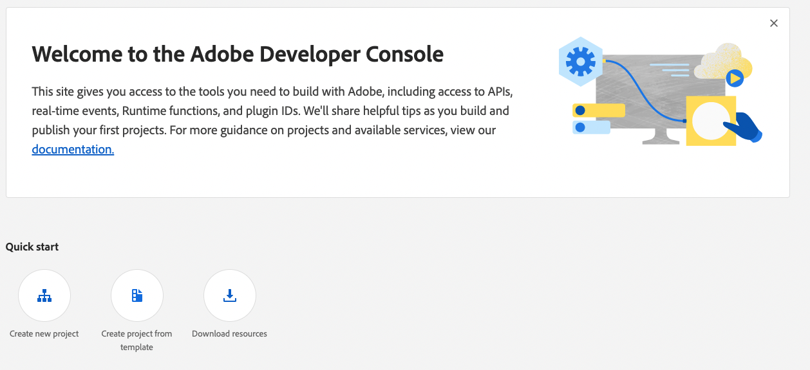
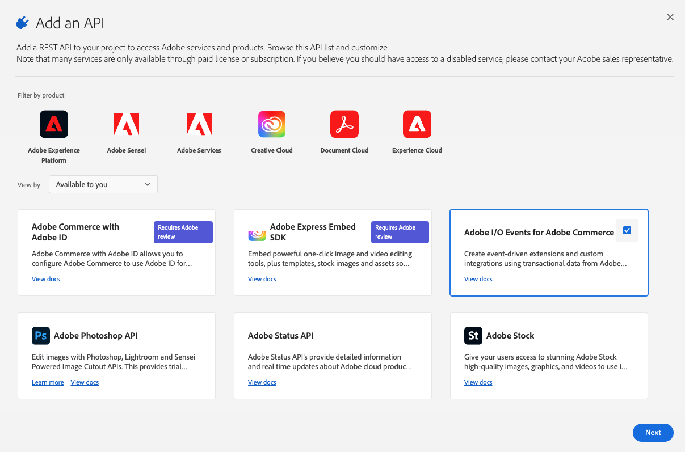

# Setup an eventing project

Adobe I/O Events for Adobe Commerce allows you to send and monitor custom Adobe Commerce user driven events. Follow the instructions on this page to create and configure a project for Adobe I/O Events.

## Requirements

To get started with Adobe I/O Events, you will need:

- the [Magento Cloud CLI] tool
- an Adobe Commerce on cloud infrastructure instance
- an IMS Organization with AppBuilder

## Set up the Event Provider

To create a project:

1. In the [Adobe Developer Console], select the desired organization from the dropdown in the top-right corner.

1. Select an existing project or [create a new project].

    

1. Inside the project, click **Add API**.

    

1. Filter by Adobe Services, select **I/O Events**, and click **Next**.

    

1. Select the **Generate a key pair** option and click **Generate keypair**. A `config.zip` file, which contains a `certificate_pub.crt` and `private.key` file, will automatically download.

    

    **Note**: If you want to manually [create a public key certificate], you can select the **Upload your public key** option.

1. Click **Save configured API**.

## Download workspace configuration

To download a `.json` file containing your workspace configuration:

1. Open the corresponding project on the [Adobe Developer Console].

1. Select the **Project Overview** and click the **Download** button.

    

<!-- Link Definitions -->
[Adobe Developer Console]: https://developer.adobe.com/console
[Magento Cloud CLI]: https://devdocs.magento.com/cloud/reference/cli-ref-topic.html
[create a new project]: https://developer.adobe.com/developer-console/docs/guides/projects/#create-a-new-project
[create a public key certificate]: https://developer.adobe.com/developer-console/docs/guides/authentication/JWT/JWTCertificate/