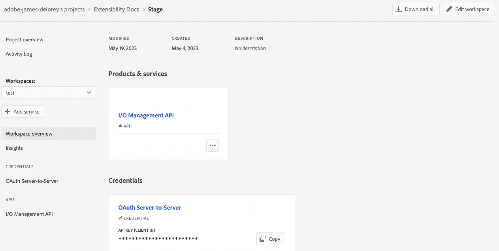
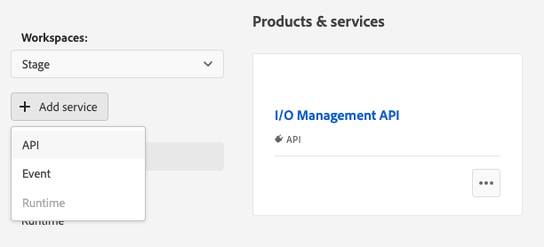
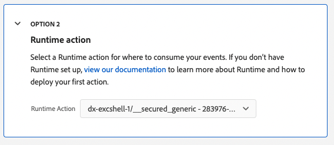

# Set up an eventing project

Adobe I/O Events for Adobe Commerce allows you to send and monitor custom Adobe Commerce user-driven events. Follow the instructions on this page to create and configure a project for Adobe I/O Events.

## Requirements

To get started with Adobe I/O Events, you will need:

*  An Adobe Developer account with System Administrator or Developer Role permissions. [Getting started with Adobe Developer Console](https://developer.adobe.com/developer-console/docs/guides/getting-started/) describes how to enroll in the Adobe developer program.

*  An Adobe Commerce on cloud infrastructure or on-premises instance.

## Set up a project

[Projects Overview](https://developer.adobe.com/developer-console/docs/guides/projects/) describes the different types of projects and how to manage them. Here, we'll create a templated project.

1. In the Adobe Developer Console, select the desired organization from the dropdown menu in the top-right corner.

1. Select **Create project from template**.

   

1. On the **Set up templated project** page, specify a project title and app name. Then click **Save**. The Console creates a Production and a Stage workspace.

   

1. In the Stage workspace, click the **Add service** pop-up menu and select **API**.

1. On the **Add an API** page, filter by Adobe Services, select **I/O Events**, and click **Next**.

   

1. Select the **Generate a key pair** option and click **Generate keypair**. The `config.zip` file downloads automatically.

   

   **Note**: If you want to manually [create a public key certificate](https://developer.adobe.com/developer-console/docs/guides/authentication/JWT/JWTCertificate/), you can select the **Upload your public key** option.

1. Click **Save configured API**.

1. Unzip the downloaded `config.zip` file. The extracted `config` directory should contain a `certificate_pub.crt` and a `private.key` file.

## Download the workspace configuration file

To download a `.json` file containing your workspace configuration:

1. Open the corresponding project on the Adobe Developer Console.

1. Select the **Project Overview** and click the **Download** button.

   

   The `<Workspace-name>.json` file downloads automatically.

## Set up App Builder and define a runtime action

The first step to setting up your App Builder template is to set up your environment and create a runtime action. For details about this process, see [Setting up Your Environment](https://developer.adobe.com/runtime/docs/guides/getting-started/setup/).

1. Log in to Adobe IO:

   ```bash
   aio login
   ```

   Your web browser displays the log in page. Enter your Adobe ID credentials.

1. Return to your terminal and navigate to where you want to initialize your project. Enter the following command:

   ```bash
   aio app init
   ```

   The terminal prompts you to select the path to your workspace.

1. Select your project's organization.

1. Select your project.

1. Select the  **DX Experience Cloud SPA** option. The command then initializes a project with a default UI and creates a default Adobe I/O Runtime Action with a name similar to `dx-excshell-1/__secured_generic-<organization-id>-<project-name>-<workspace-name>`. The event configuration process requires that at least one action be defined.

   **Note**: The action has an internal name of `dx-excshell-1/generic`. You might see this referenced in the output in the next step.

1. Launch App Builder by running the following command:

   ```bash
   aio app run
   ```

   The command displays the URL where you can access the default UI. Running the command enables the runtime action that referenced in [Subscribe and register events](#subscribe-and-register-events).

## Begin configuring events on Commerce

You must configure Commerce to communicate with your project. You will need the files that you downloaded from the the Adobe Developer Console.

1. In the Commerce Admin, navigate to **Stores** > Settings > **Configuration** > **Adobe Services** > **Adobe I/O Events** > **General configuration**.

1. Copy and paste the contents of the `private.key` file into the **Service Account Private Key** field. Use the following command to copy the contents.

   ```bash
   cat config/private.key | pbcopy
   ```

1. Copy the contents of the `<workspace-name>.json` file into the **Adobe I/O Workspace Configuration** field.

1. Enter a unique identifier in the **Adobe Commerce Instance ID** field. This value can be any string, but it must be unique.

1. Click **Save Config** but do not leave the page.

## Create an event provider and finish Commerce configuration

You cannot create an event provider until after you have configured and saved the private key, workspace file, and instance ID values.

1. Create a `<Commerce-root-directory>/app/etc/event-types.json` file and add the following contents:

   ```json
   {
    "provider": {
        "label": "My Adobe Commerce Events",
        "description": "Provides out-of-process extensibility for Adobe Commerce"
        }
    }
    ```

1. Run the following command to create an event provider:

   ```bash
   bin/magento events:create-event-provider
   ```

   The command displays a message similar to the the following:

   ```terminal
   No event provider found, a new event provider will be created
   A new event provider has been created with ID 63a1f8fe-e911-45a4-9d3f
   ```

1. Copy the ID returned in the command output into the **Adobe I/O Event Provider ID** field in the Admin.

1. Click **Save Config**.

## Subscribe and register events

You must define which Commerce events to subscribe to, then register them in the project.

Commerce provides two sources for events: observers and plugins. You must specify the source as part of the event name. See [Subscribe to a Commerce event](./commands.md#subscribe-to-a-commerce-event) for details about the syntax of the `events:subscribe` command.

1. Use the `events:subscribe` command to subscribe to Commerce events, as shown in the following examples:

   ```bash
   bin/magento events:subscribe observer.catalog_product_save_after
   ```

   ```bash
   bin/magento events:subscribe observer.customer_login
   ```

   ```bash
   bin/magento events:subscribe plugin.magento.customer.api.account_management.create_account
   ```

1. Return to your Stage workspace. Click the **Add service** pop-up menu and select **Event**.

   

1. On the **Add events** page, select your event provider, then click **Next**.

   

1. Select the events to subscribe to. Then click **Next**.

   

1. Optionally create a new JWT credential. Then click **Next**.

1. Update the **Event registration name** and **Event registration description** fields. In the **How to receive events** section, under **Option 2**, select the runtime action you created in [Set up App Builder and define a runtime action](#set-up-app-builder-and-define-a-runtime-action).

   

1. Select **Save configured events**.
