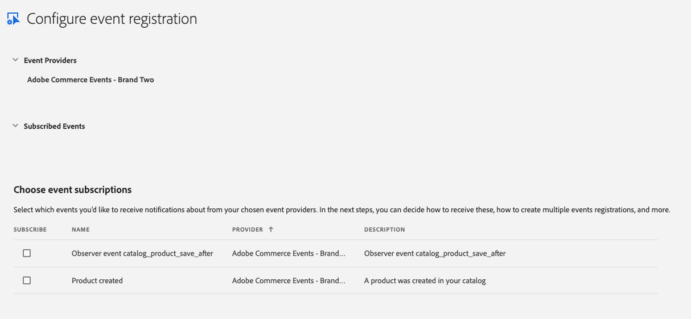

# Configure Adobe Commerce

After you have created an [App Builder project](./project-setup.md) and [install the eventing modules](./installation.md), you must download several files from the App Builder project and configure eventing in the Commerce admin.

## Begin configuring events on Commerce

You must configure Commerce to communicate with your project. You will need a configuration file that you downloaded from the Adobe Developer Console.
*  
* [Workspace configuration](./project-setup.md#download-the-workspace-configuration-file)

1. In the Commerce Admin, navigate to **Stores** > Settings > **Configuration** > **Adobe Services** > **Adobe I/O Events** > **General configuration**. The following screen displays.


1. Copy the contents of the `<workspace-name>.json` file into the **Adobe I/O Workspace Configuration** field.

1. Enter a unique identifier in the **Adobe Commerce Instance ID** field. This value must contain English alphanumeric characters, underscores (_), and hyphens (-) only.

1. Click **Save Config**, but do not leave the page. The next section creates an event provider, which is necessary to complete the configuration.

## Create an event provider and complete the Commerce configuration

You cannot create an event provider until you have configured and saved workspace file and instance ID values.

1. Run the following command to create an event provider:

   ```bash
   bin/magento events:create-event-provider --label "<unique_provider_label>" --description "<provider description>"
   ```

   For example:

   ```bash
   bin/magento events:create-event-provider --label "My_server_provider" --description "Provides out-of-process extensibility for Adobe Commerce"
   ```

   **Note**: The label can contain English alphanumeric characters and underscores (_) only. The first character must be a letter.

   The command displays a message similar to the the following:

   ```terminal
   No event provider found, a new event provider will be created
   A new event provider has been created with ID 63a1f8fe-e911-45a4-9d3f
   ```

1. Copy the ID returned in the command output into the **Adobe I/O Event Provider ID** field in the Admin.

   

1. Enable Commerce Eventing by setting **Enabled** to `Yes`.

   **Note**: You must [enable cron](#check-cron-and-message-queue-configuration) so that Commerce can send events to the endpoint.

1. Enter the merchant's company name in the **Merchant ID** field. You must use alphanumeric and underscores only.

1. In the **Environment ID** field, enter a temporary name for your workspaces while you are in development mode. When you are ready for production, change this value to a permanent value, such as **Production**.

1. (Optional) By default, if an error occurs when Adobe Commerce attempts to send an event to Adobe I/O, Commerce retries a maximum of three times. To change this value, uncheck the **Use system value** checkbox and set a new value in the **Maximum retries to send events** field.

1. (Optional) By default, Adobe Commerce runs a cron job (clean_event_data) every 24 hours that deletes event data that is three days old. To change the number of days to retain event data, uncheck the **Use system value** checkbox and set a new value in the **Event retention time (in days)** field.

1. Click **Save Config**.

## Subscribe and register events

You must define which Commerce events to subscribe to, then register them in the project.

Commerce provides two sources for events: observers and plugins. You must specify the source as part of the event name. See [Subscribe to a Commerce event](./commands.md) for details about the syntax of the `events:subscribe` command.

1. If you don't have a module ready for integration with Adobe I/O Events, or you don't know exactly which events to register at this point, use the `events:subscribe` command to subscribe to some sample events, as shown in the following example commands:

   ```bash
   bin/magento events:subscribe observer.catalog_product_save_after --fields=sku --fields=stock_data.qty
   ```

   ```bash
   bin/magento events:subscribe observer.customer_login --fields=firstname --fields=lastname --fields=entity_id
   ```

   If you have a module ready or have specific events in mind, see [Register events](./module-development.md#register-events) for more information.

1. Return to your workspace. Click the **Add service** pop-up menu and select **Event**.

   

1. On the **Add events** page, select your event provider. Then click **Next**.

1. Select the events to subscribe to. Then click **Next**.

   

1. Optionally create a new OAuth credential. Then click **Next**.

1. Update the **Event registration name** and **Event registration description** fields. In the **How to receive events** section, under **Option 2**, select the runtime action you created in [Set up App Builder and define a runtime action](./project-setup.md#set-up-app-builder-and-define-a-runtime-action).

   

1. Select **Save configured events**.

You are now set up to develop your App Builder extension.

## Check cron and message queue configuration

Cron and message queues must be enabled. Commerce uses the `event_data_batch_send` cron job to transmit batches of event messages and the `clean_event_data` cron job to remove these messages from the database. These cron jobs are part of the `default` group.

The `commerce.eventing.event.publish` message queue consumer helps expedite registered events that have been designated as priority. The consumer processes priority events within a second of their receipt. By default, it can take up to 59 seconds for cron to process standard-priority events.

In Adobe Commerce on cloud infrastructure, update your `.magento.env.yaml` file with the following changes to the `global` and `deploy` stages:

```yaml
stage:
  global:
    ENABLE_EVENTING: true
  deploy:
    CRON_CONSUMERS_RUNNER:
      cron_run: true
      max_messages: 0
      consumers: []
```

See [Global variables](https://experienceleague.adobe.com/docs/commerce-cloud-service/user-guide/configure/env/stage/variables-global.html) for more information about the `ENABLE_EVENTING` variable.

Cloud infrastructure and on-premises instances require different cron management procedures as described here:

*  [Adobe Commerce on cloud infrastructure](https://experienceleague.adobe.com/docs/commerce-cloud-service/user-guide/configure/app/properties/crons-property.html)

*  [On premises](https://experienceleague.adobe.com/docs/commerce-operations/configuration-guide/crons/custom-cron-reference.html)
